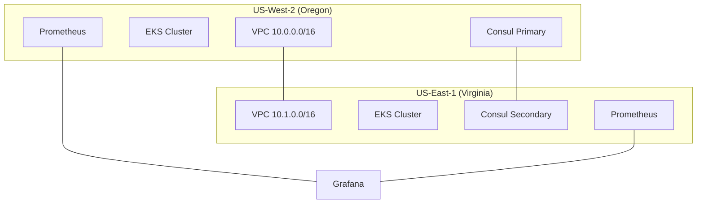

# AWS Multi-Region Consul Federation Infrastructure

This repository contains Terraform configurations and Kubernetes manifests for deploying a production-grade, WAN-federated Consul cluster across multiple AWS regions.

## Architecture Overview


## Version Requirements

- Terraform >= 1.5.0
- AWS Provider >= 5.0.0
- Kubernetes Provider >= 2.23.0
- Helm Provider >= 2.11.0
- Consul Enterprise >= 1.16.0
- Kubernetes >= 1.25.0

## Prerequisites

- AWS Account with appropriate permissions
- AWS CLI configured
- Terraform >= 1.5.0
- kubectl >= 1.25.0
- helm >= 3.0.0

## Quick Start

1. Clone the repository:
```bash
git clone https://github.com/yourusername/aws-consul-federation.git
cd aws-consul-federation
```

2. Configure AWS credentials:
```bash
aws configure
```

3. Initialize Terraform:
```bash
terraform init
```

4. Copy and modify the example variables:
```bash
cp terraform.tfvars.example terraform.tfvars
# Edit terraform.tfvars with your values
```

5. Deploy the infrastructure:
```bash
terraform plan
terraform apply
```

## Security Features

- TLS encryption for all communication
- mTLS for service-to-service communication
- Gossip encryption for cluster communication
- AWS KMS for key management
- Network policies for pod-to-pod communication
- IAM roles with least privilege access

## Disaster Recovery

- Automated backups every 6 hours
- Cross-region snapshot replication
- Automated failover capabilities
- Regular health checks
- See [docs/DISASTER_RECOVERY.md](docs/DISASTER_RECOVERY.md) for details

## Monitoring

- Prometheus metrics collection
- Grafana dashboards
- AlertManager configuration
- Cross-region metric aggregation
- See [docs/MONITORING.md](docs/MONITORING.md) for details

## Cost Considerations

Estimated monthly costs (USD):
- EKS Clusters: $146 ($73 per cluster)
- EC2 Instances: $140-280 (depending on size/count)
- Load Balancers: $40
- Data Transfer: $50-100
- S3 Storage: $5-10
Total: ~$400-600/month

## Documentation

- [Setup Guide](docs/SETUP.md)
- [Architecture Details](docs/ARCHITECTURE.md)
- [Security Guide](docs/SECURITY.md)
- [Monitoring Guide](docs/MONITORING.md)
- [Disaster Recovery](docs/DISASTER_RECOVERY.md)
- [Troubleshooting](docs/TROUBLESHOOTING.md)
- [Contributing](docs/CONTRIBUTING.md)
- [Upgrade Guide](docs/UPGRADE.md)
- [FAQ](docs/FAQ.md)

## Repository Structure

```
.
├── modules/                    # Reusable Terraform modules
│   ├── consul/                # Base Consul installation and AWS integration
│   ├── consul-federation/     # Consul federation specific configurations
│   ├── eks/                   # EKS cluster management
│   ├── monitoring/           # Monitoring stack (Prometheus, Grafana)
│   ├── networking/           # VPC and network configurations
│   └── security/             # Security configurations and policies
├── docs/                      # Documentation
├── examples/                  # Example configurations
├── test/                     # Test suites
├── main.tf                   # Root module configuration
├── variables.tf              # Input variables
└── versions.tf               # Version constraints
```

## Contributing

1. Fork the repository
2. Create a feature branch
3. Commit changes
4. Create a pull request

## License

MIT License - See [LICENSE](LICENSE) for details

## Support

For issues and feature requests, please open an issue in the GitHub repository.
