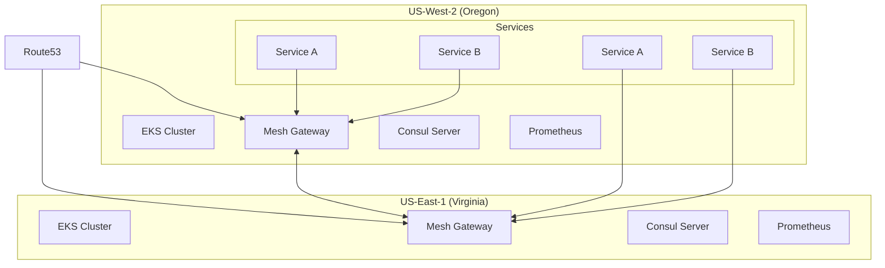

# Multi-Region Consul Federation Architecture

## Overview
This document describes the architecture of our multi-region Consul federation deployment across AWS regions (Oregon and Virginia).

## Architecture Diagram

## Component Details

### Network Architecture
- VPC in each region (CIDR: 10.0.0.0/16 and 10.1.0.0/16)
- VPC peering between regions
- Private subnets for EKS nodes
- Public subnets for load balancers
- Transit Gateway for cross-region communication

### Security Architecture
1. **TLS Encryption**
   - mTLS between all services
   - Auto-rotation of certificates
   - AWS Certificate Manager integration

2. **Access Control**
   - Consul ACLs enabled
   - Token-based authentication
   - RBAC policies
   - AWS IAM integration

3. **Network Security**
   - Security groups
   - Network policies
   - Private endpoints
   - WAF protection

### High Availability
1. **Multi-AZ Deployment**
   - Consul servers across 3 AZs
   - EKS worker nodes across 3 AZs
   - RDS Multi-AZ for metrics storage

2. **Failover Mechanism**
   - Automated leader election
   - Cross-region service failover
   - Route53 health checks
   - Automated recovery

### Observability Stack
1. **Metrics**
   - Prometheus servers in each region
   - Cross-region metric federation
   - Long-term storage in Thanos

2. **Logging**
   - CloudWatch Logs
   - Log aggregation
   - Audit logging

3. **Tracing**
   - Jaeger integration
   - Cross-DC trace correlation
   - Sampling policies

## Scaling Considerations

### Horizontal Scaling
- EKS worker nodes: Auto-scaling groups
- Consul servers: Fixed 3-5 per region
- Service instances: HPA based on metrics

### Vertical Scaling
- Instance types optimized for workload
- Resource requests/limits defined
- Buffer capacity maintained

## Disaster Recovery

### Backup Strategy
1. **Regular Backups**
   - Automated snapshots
   - Cross-region replication
   - Encrypted storage

2. **Recovery Procedures**
   - RTO: < 15 minutes
   - RPO: < 5 minutes
   - Automated recovery playbooks

### Failover Strategy
1. **Active-Active**
   - Both regions serve traffic
   - Load balancing via Route53
   - Automatic failover

2. **Data Consistency**
   - Raft consensus protocol
   - Anti-entropy mechanism
   - Conflict resolution

## Cost Optimization
- Spot instances for worker nodes
- Auto-scaling based on demand
- Resource quotas
- Cost allocation tags

## Security Compliance
- SOC2 compliant configuration
- PCI-DSS ready
- HIPAA compatible
- GDPR considerations
