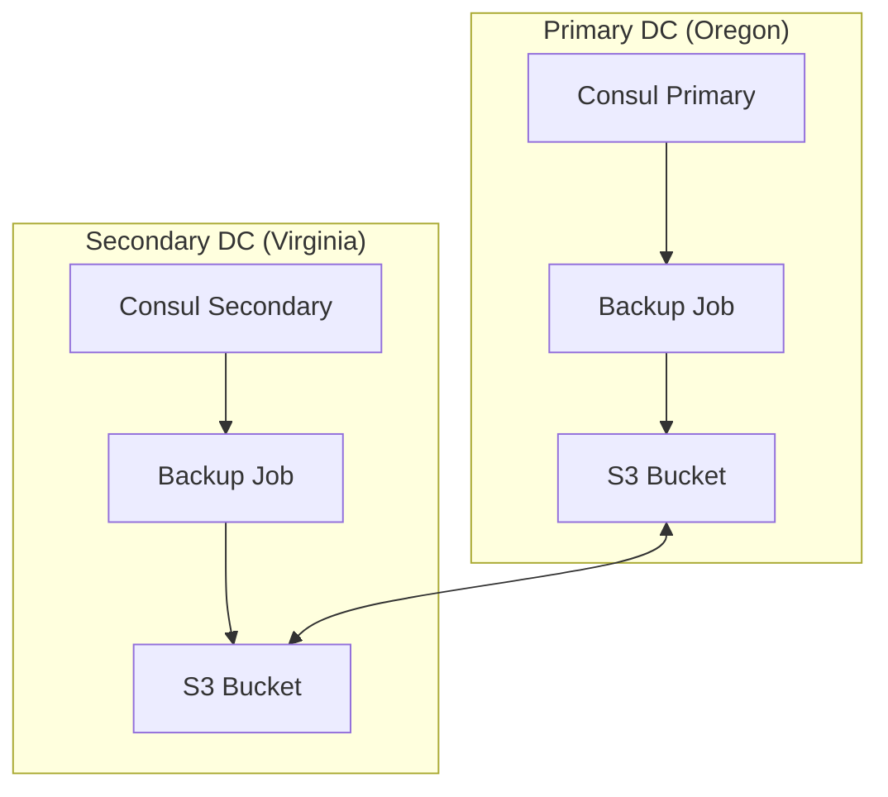

# Consul Federation Disaster Recovery Guide

## Overview

This document outlines disaster recovery procedures for the multi-region Consul federation deployment. The environment spans two AWS regions (Oregon and Virginia) with automated backup, restore, and failover capabilities.

## Architecture



## Backup Strategy

### Automated Backups

- **Schedule**: Every 6 hours
- **Retention**: Last 5 snapshots per region
- **Storage**: AWS S3 with cross-region replication
- **Encryption**: Server-side encryption with AWS KMS
- **Verification**: Automated backup testing daily

### Backup Contents

- Consul KV store
- ACL configurations
- Service definitions
- Intention rules
- TLS certificates

## Recovery Procedures

### 1. Single Server Failure

```bash
# 1. Verify server status
kubectl exec -n consul consul-server-0 -- consul operator raft list-peers

# 2. Remove failed server
kubectl exec -n consul consul-server-0 -- consul operator raft remove-peer <failed-server-id>

# 3. Replace failed pod
kubectl delete pod -n consul <failed-pod>
```

### 2. Complete DC Failure

```bash
# 1. Verify federation status
consul members -wan

# 2. Remove failed DC from federation
consul operator raft remove-peer -datacenter <failed-dc>

# 3. Update DNS to redirect traffic
aws route53 change-resource-record-sets --hosted-zone-id <zone-id> --change-batch file://dns-failover.json

# 4. Scale up resources in surviving DC
kubectl scale statefulset consul-server -n consul --replicas=5
```

### 3. Data Recovery from Backup

```bash
# 1. List available snapshots
aws s3 ls s3://${BACKUP_BUCKET}/consul-snapshots/

# 2. Download latest snapshot
aws s3 cp s3://${BACKUP_BUCKET}/consul-snapshots/latest.snap ./

# 3. Restore snapshot
consul snapshot restore ./latest.snap
```

## Failover Testing

Regular failover testing is automated through chaos engineering tests in the CI/CD pipeline:

1. **Network Partition Tests**: Simulates network splits between DCs
2. **Node Failure Tests**: Randomly terminates Consul servers
3. **Resource Exhaustion**: Tests behavior under high load
4. **DNS Failover**: Validates automatic DNS updates

## Performance Tuning

### Server Sizing

- **CPU**: 4-8 cores recommended
- **Memory**: 8-16GB RAM per server
- **Storage**: 50GB+ with high IOPS

### Network Configuration

- **Latency**: <100ms RTT between regions
- **Bandwidth**: 100Mbps+ dedicated
- **MTU**: 1500 (jumbo frames where supported)

### Monitoring Thresholds

- **CPU Usage**: Alert at 80%
- **Memory Usage**: Alert at 85%
- **Disk Usage**: Alert at 75%
- **Raft Timing**: Alert if commit time >100ms

## Verification Procedures

### Daily Automated Checks

1. Backup Creation
2. Snapshot Integrity
3. Replication Status
4. TLS Certificate Validity
5. ACL Token Rotation

### Weekly Manual Checks

1. Failover Testing
2. Backup Restoration
3. Performance Benchmarks
4. Security Audits

## Emergency Contacts

- **Primary On-Call**: DevOps Team (PagerDuty)
- **Secondary**: Platform Engineering
- **Escalation**: Infrastructure Lead

## Recovery Time Objectives (RTO)

- Single Server Failure: <5 minutes
- Availability Zone Failure: <15 minutes
- Region Failure: <30 minutes
- Complete Data Recovery: <60 minutes

## Recovery Point Objectives (RPO)

- Maximum Data Loss: 6 hours (backup interval)
- Typical Data Loss: <1 minute (replication lag)

## Runbooks

### 1. Emergency Access Procedure

```bash
# 1. Generate emergency token
consul acl token create -policy-name global-management -description "emergency-access"

# 2. Configure kubectl
aws eks update-kubeconfig --region <region> --name <cluster-name>

# 3. Access Consul UI
kubectl port-forward svc/consul-ui 8500:80
```

### 2. Manual Backup Procedure

```bash
# 1. Create snapshot
consul snapshot save backup.snap

# 2. Verify snapshot
consul snapshot inspect backup.snap

# 3. Upload to S3
aws s3 cp backup.snap s3://${BACKUP_BUCKET}/consul-snapshots/manual/
```

### 3. Cross-Region Replication Check

```bash
# 1. Write test key
consul kv put test/replication $(date)

# 2. Verify in secondary DC
consul kv get -datacenter=dc2 test/replication

# 3. Check replication metrics
curl -s http://localhost:8500/v1/agent/metrics
```

## Prevention Measures

### 1. Infrastructure

- Multi-AZ deployment
- Auto-scaling groups
- Health checks
- Load balancing

### 2. Data Protection

- Regular backups
- Data validation
- Corruption detection
- Version control

## Documentation

### 1. Required Information

- AWS credentials
- Backup locations
- Contact information
- Escalation procedures

### 2. Recovery Logs

- Date and time
- Actions taken
- Results
- Lessons learned

## Testing Schedule

### Monthly Tests

- [ ] Backup restoration
- [ ] Node failure recovery
- [ ] Service failover
- [ ] Data validation

### Quarterly Tests

- [ ] Full DC failover
- [ ] Cross-region recovery
- [ ] Network partition
- [ ] Load testing

## References

- [Consul Backup Guide](https://www.consul.io/docs/commands/snapshot)
- [AWS Disaster Recovery](https://aws.amazon.com/disaster-recovery/)
- [EKS Best Practices](https://aws.github.io/aws-eks-best-practices/)
- [Kubernetes StatefulSets](https://kubernetes.io/docs/concepts/workloads/controllers/statefulset/)
