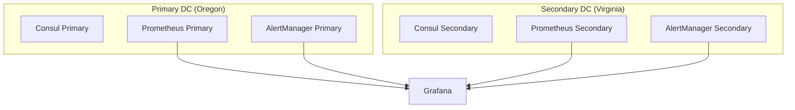

# Monitoring Guide

This guide details the monitoring setup for the AWS Multi-Region Consul Federation infrastructure.

## Architecture



## Components

### 1. Prometheus

- Deployed in each region
- Scrapes metrics from:
  - Consul servers
  - Consul clients
  - EKS clusters
  - Service mesh proxies

#### Key Metrics

1. Consul Health:
   - consul_up
   - consul_raft_leader
   - consul_serf_members

2. Service Mesh:
   - envoy_cluster_upstream_rq_total
   - envoy_cluster_upstream_rq_time_ms
   - envoy_cluster_upstream_cx_active

3. Infrastructure:
   - node_cpu_seconds_total
   - node_memory_MemAvailable_bytes
   - node_disk_io_time_seconds_total

### 2. Grafana

- Central dashboard for all metrics
- Pre-configured dashboards:
  - Consul Overview
  - Service Mesh Performance
  - Cross-DC Latency
  - Resource Usage

### 3. AlertManager

- Configured for various alert channels:
  - Email
  - Slack
  - PagerDuty

## Alert Rules

### Critical Alerts

```yaml
groups:
- name: consul.rules
  rules:
  - alert: ConsulLeaderLoss
    expr: consul_raft_leader == 0
    for: 1m
    labels:
      severity: critical
    annotations:
      summary: Consul cluster has no leader
      
  - alert: ConsulHighLatency
    expr: consul_rpc_request_ms > 500
    for: 5m
    labels:
      severity: warning
    annotations:
      summary: High Consul RPC latency
```

## Dashboard Examples

### 1. Consul Overview

- Server Status
- Client Connections
- Service Health
- Resource Usage

### 2. Service Mesh

- Request Rate
- Error Rate
- Latency Percentiles
- Circuit Breaker Status

### 3. Cross-DC Metrics

- WAN Gossip Status
- Replication Lag
- Cross-DC Request Latency
- Bandwidth Usage

## Backup Monitoring

1. Backup Job Status
2. S3 Storage Metrics
3. Restore Test Results
4. Snapshot Age

## Security Monitoring

1. TLS Certificate Expiry
2. ACL Token Usage
3. Authentication Failures
4. Network Policy Violations

## Cost Monitoring

1. EKS Resource Usage
2. EC2 Instance Metrics
3. Network Transfer
4. S3 Storage Usage

## Maintenance

### Daily Tasks

1. Check dashboard alerts
2. Verify backup completion
3. Review resource usage
4. Check service health

### Weekly Tasks

1. Review alert history
2. Analyze performance trends
3. Update dashboard configurations
4. Test alerting system

### Monthly Tasks

1. Review and update alert thresholds
2. Clean up old metrics data
3. Optimize resource usage
4. Update documentation

## Troubleshooting

### Common Issues

1. Missing Metrics
   ```bash
   kubectl get pods -n monitoring
   kubectl logs prometheus-server-0 -n monitoring
   ```

2. Alert Manager Issues
   ```bash
   kubectl describe configmap alertmanager-config -n monitoring
   ```

3. Grafana Problems
   ```bash
   kubectl logs grafana-0 -n monitoring
   ```

## References

- [Prometheus Documentation](https://prometheus.io/docs/)
- [Grafana Documentation](https://grafana.com/docs/)
- [Consul Metrics](https://www.consul.io/docs/agent/telemetry)
- [AlertManager Documentation](https://prometheus.io/docs/alerting/latest/alertmanager/)
