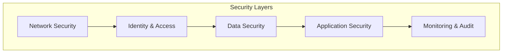

# Security Guide

This guide outlines the security measures implemented in the AWS Multi-Region Consul Federation infrastructure.

## Security Architecture



## Network Security

### 1. VPC Configuration

- Separate VPCs per region
- Private subnets for EKS nodes
- VPC peering with restricted access
- Network ACLs and Security Groups

### 2. Network Policies

```yaml
apiVersion: networking.k8s.io/v1
kind: NetworkPolicy
metadata:
  name: consul-server-policy
  namespace: consul
spec:
  podSelector:
    matchLabels:
      app: consul
      component: server
  policyTypes:
    - Ingress
    - Egress
  ingress:
    - from:
        - podSelector:
            matchLabels:
              app: consul
    ports:
        - port: 8300
        - port: 8301
        - port: 8302
        - port: 8500
        - port: 8600
```

## Identity & Access Management

### 1. AWS IAM

- Service accounts with least privilege
- Role-based access control
- Regular credential rotation
- MFA enforcement

### 2. Consul ACLs

```hcl
# Example ACL Policy
service "web" {
  policy = "write"
}
service "api" {
  policy = "read"
}
key_prefix "app/" {
  policy = "read"
}
```

## Data Security

### 1. Encryption at Rest

- AWS KMS for key management
- Encrypted EBS volumes
- S3 bucket encryption
- Secrets encryption

### 2. Encryption in Transit

- TLS 1.3 enforcement
- mTLS for service mesh
- Gossip encryption
- Certificate management

## Application Security

### 1. Pod Security

```yaml
apiVersion: v1
kind: Pod
metadata:
  name: consul-server
spec:
  securityContext:
    runAsNonRoot: true
    runAsUser: 100
    fsGroup: 1000
  containers:
  - name: consul
    securityContext:
      allowPrivilegeEscalation: false
      readOnlyRootFilesystem: true
```

### 2. Service Mesh Security

- Service-to-service authentication
- Traffic encryption
- Intent-based networking
- Circuit breaking

## Monitoring & Audit

### 1. AWS CloudTrail

- API activity logging
- Resource monitoring
- Compliance auditing
- Alert configuration

### 2. Consul Audit Logging

```hcl
audit {
  enabled = true
  sink "file" {
    type = "file"
    format = "json"
    path = "/var/log/consul/audit.log"
    delivery_guarantee = "best-effort"
    rotate_duration = "24h"
    rotate_max_files = 15
  }
}
```

## Security Checklist

### Initial Setup

- [ ] Configure VPC security groups
- [ ] Set up IAM roles and policies
- [ ] Enable encryption at rest
- [ ] Configure TLS certificates
- [ ] Set up network policies

### Regular Maintenance

- [ ] Rotate credentials
- [ ] Update TLS certificates
- [ ] Review audit logs
- [ ] Update security patches
- [ ] Test backup encryption

## Incident Response

### 1. Detection

- CloudWatch Alerts
- Prometheus Alerts
- Log Analysis
- Network Monitoring

### 2. Response

1. Isolate affected systems
2. Assess impact
3. Implement fixes
4. Document incident
5. Update procedures

## Compliance

### 1. Standards

- SOC 2
- HIPAA
- GDPR
- PCI DSS

### 2. Auditing

- Regular security audits
- Penetration testing
- Compliance reviews
- Documentation updates

## Security Tools

### 1. Infrastructure

- AWS GuardDuty
- AWS Security Hub
- AWS Config
- AWS Inspector

### 2. Application

- Container scanning
- Dependency scanning
- SAST/DAST
- Secret scanning

## Best Practices

### 1. Access Control

- Use least privilege principle
- Implement MFA
- Regular access reviews
- Session management

### 2. Network Security

- Segment networks
- Use private endpoints
- Filter traffic
- Monitor connections

### 3. Data Protection

- Encrypt sensitive data
- Secure backups
- Data classification
- Access logging

## References

- [AWS Security Best Practices](https://aws.amazon.com/security/security-learning/)
- [Consul Security Guide](https://www.consul.io/docs/security)
- [Kubernetes Security](https://kubernetes.io/docs/concepts/security/)
- [TLS Best Practices](https://www.acunetix.com/blog/articles/tls-security-best-practices-ssl-audit/)
